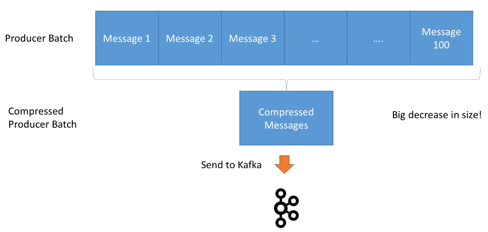

# Kafka

## Filas

O protocolo AMQP:


## Conceitos

### Tópicos

Topic: nome identificativo

Partitions: Um tópico tem n partições que sõ definidas na criação do tópico e esse número pode ser modificado depois. As partitions tem nome de `Partition` + número sequencial, começando por zero. Se tiver três partitions, teremos `Partition 0`, `Partition 1` e `Partition 2`.

Mensagens: Cada mensagem que é postada no tópico vai parar numa partição. Ele recebe uma numeração sequencial dentro do tópico chamada de offset. Então, para definir uma mensagem precisamos de `Topic name` + `Partition number` + `offset`.

Importante: A ordem das mensagens (offset) é garantida dentro da partição, mas não entre partições


Por padrão, as mensagens são mantidas por 7 dias, mas é configurável.

### Clusters

Os clusters são formados por `brokers`, que basicamente são servidores ou instâncias, também recebem um identifidor numérico, mas que pode ser aletório.

Os tópicos e as partições são espalhados pelos `brokers` sem uma ordem específica:


### Replicação

A replicação consiste em replicar as partições dos tópicos em outros brokers. O padrão de replicação é entre dois e três replicações. 

Cada partition tem um broker líder. Só é feita escrita de mensagens nesse broker, e o cluster cuida da replicação para o resto, chamada de ISR (In-sync replica).


Os tópicos só podem ter um fator de replicação menor ou igual ao número de brokers

### Producers

Os producers sabem automaticamente sem ter que programar nada onde vão escrever - Broker e partition. Se não especificar nada na hora de mandar a mensagem, cada uma será postada num broker e partition diferente via round robin.


Existem três tipos  de confirmação:
- acks=0 : Não é esperada confirmação. Pode perder mensagens se o broker estiver offline.
- acks=1 : Espera a confirmação do líder. Em alguns casos, pode perder mensagens.
- acks=all : é esperada a confirmação dos líderes e das réplicas. 

Podemos mandar as mensagens com uma key, que pode ser qualquer coisa. Nesse caso é garantido que cairá na mesma partição, preservando a ordenação das mensagens, mas a partição não é escolhida diretamente. **Isso é verdade enquanto o número de partições não mudar**.

`Nota`: Quando selecionamos o `acks=all`, precisamos levar em consideração o fator de replicação e o mínimo de ISR. Então, se tiver um fator de replicação de 3, e a configuração de mínimo de ISR é 2, só poderemos ter um broker offline quando o produtor seja `acks=all`.

Os produtores nas versões maiores da 2.1, vão retentar reenviar a mensagem bilhões de vezes, com um timeout de 100 ms entre tentativa. Esses parâmetros são configuráveis. Então, pelos dados, se houver algum erro, a retentativa vai tomar muito tempo, mas existe outro parâmetro que é o `producer timeout` que evita isso

#### Imdepotência

Nas versões iniciais do Kafka poderia acontecer o seguinte:


Após a versão 0.11, o kafka gera um id de mensagem e sabe lidar com cenârios de duplicidade. É uma opção que precisa/pode ser ativada no producer.

### Compressão

As mensagens podem ser agrupadas e comprimidas para optimização de fluxos. Quanto mais mensagens, maior o ganho de performance:



Para fazer isso precisamos brincar nas configurações dos producers para introduzir latência na produção, de forma que as mensagens possam ser agrupadas.

### Consumers

Igual que os producers, os consumers sabem exatamente em que broker/partition vão ler as mensagens. Cada consumidor pode ler de mais de uma partition mas a ordem não é garantida entre partições.


Os consumers são agrupados por grupos. Cada grupo de consumidores tem um nome que pode ser explicitado. O grupo de consumidores vai distribuir a leitura entre os diferentes consumidores disponíveis.


Podemos ter mais consumidores que partitions, mas nesse caso o excedente fica inativo esperando por se algum consumidor cair. Por isso é importante definir o número de partitions no começo.

### Consumers offsets

O kafka guarda os offsets para cada grupo de consumidores, e isso é guardado num tópico chamado `__consummer_offsets`. Normalmente o consumidor já faz isso e não precisa implementar. 

Quando vamos commitar o offset, precisamos indicar qual semântica queremos usar. Temos três tipos:
- At most once: Tão cedo quando recebemos a mensagem, commitamos o offset. Pode gerar perda de mensagem caso ao processar a mensagem aconteça um erro inesperado.
- At least once: Após a leitura das mensagens, commitamos. Pode gerar leituras duplicadas caso o consumidor morrer antes de commitar. Por isso precisamos que nosso sistema consumidor seja imdepotente.
- Exacly once: É só de kafka to kafka

### Kafka broker discovery

Cada broker é um bootstrap server. Isso significa que conectando em um broker, podemos acessar ao resto do cluster.

Isso acontecer porque o broker tem conhecimento de todos os brokers, tópicos e partitions mesmo não tendo mensagens deles. 

Quando um consumidor conecta num broker, solicita metadados. Assim, quando precisa ler determinada partition, só precisa verificar em que broker está e connectar nesse broker.


### Zookeper

O zookeeper é o encarregado de cuidar do cluster de kafka. Escolhe o broker leader e mantém o kafka atualizado sobre novos tópicos, estado do brokers, etc

Kafka não funciona sem zookeeper. Para um cluster de Kafka teremos um cluster de zookeeper, e número de instâncias no cluster de zookeeper é sempre ímpar. Em local um zookeeper atende, mas em prod serão 3, 5, etc


## Resumindo


### Diferenças entre RabbitMQ e Kakfa 

https://itnext.io/kafka-vs-rabbitmq-f5abc02e3912


---

## Comandos CLI

### Iniciando kafka

Primeiro, startar o zookeeper:
```
$ zookeeper-server-start.sh /opt/kafka_2.12-2.3.0/config/zookeeper.properties 
```
O arquivo properties tem a linha `dataDir=/opt/kafka_2.12-2.3.0/data/zookeeper`

```
$ kafka-server-start.sh /opt/kafka_2.12-2.3.0/config/server.properties
```
O arquivo properties tem a linha `log.dirs=/opt/kafka_2.12-2.3.0/data/kafka`

Topics: Precisamos especificar o zookeeper quando for usar o CLI para criação de Kafka topics. 
```
$ kafka-topics.sh --zookeeper localhost:2181
```
Nas novas versões, essa opção está depreciada:
```
$ kafka-topics.sh --bootstrap-server localhost:9092
```
### create
```
$ kafka-topics.sh --bootstrap-server localhost:9092 --topic first_topic --create --partitions 3 --replication-factor 1
``` 

### list
```
$ kafka-topics.sh --bootstrap-server localhost:9092 --list
``` 
### Descrição do tópico
```
$ kafka-topics.sh --bootstrap-server localhost:9092 --topic first-topic --describe
``` 
### Delete
```
$ kafka-topics.sh --bootstrap-server localhost:9092 --topic first_topic --delete
``` 
Só vai funcionar se a opção delete topic enable está true, o que por padrão é assim.

### Produce message
```
$ kafka-console-producer.sh --broker-list localhost:9092 --topic first_topic
```

### Producer com acks
```
$ kafka-console-producer.sh --broker-list localhost:9092 --topic first_topic --producer-property acks=all
```
Se o topico não existir, vai funcionar do mesmo jeito, pois vai ser criado. Vai usar a configuração de partitions e replication-factor configurado no `server.properties`. 

Uma boa prática é não deixar que o tópico seja criado automaticamente e criá-lo manualmente antes de produzir mensagens nele.

### Producer com key
```
$ kafka-console-producer --broker-list localhost:9092 --topic first_topic --property parse.key=true --property key.separator=,
> key,value
> another key,another value
```

### Consumers

```
$ kafka-console-consumer.sh --bootstrap-server localhost:9092 --topic first_topic
```
Este consumidor só vai ler as mensagens novas. Para ler  mensagens antigas:
```
$ kafka-console-consumer.sh --bootstrap-server localhost:9092 --topic first_topic --from-beginning
```

### With keys

```
$ kafka-console-consumer --bootstrap-server localhost:9092 --topic first_topic --from-beginning --property print.key=true --property key.separator=,
```

### Grupos
```
$ kafka-console-consumer.sh --bootstrap-server localhost:9092 --topic first_topic --group firstconsumer
```
Se usamos a opção `--from-beginning` vamos ler as mensagem após commit do offset, aquelas mensagens que não foram consumidas pelo grupo.

```
$ kafka-consumer-groups.sh --bootstrap-server localhost:9092 --list
```

```
$ kafka-consumer-groups.sh --bootstrap-server localhost:9092 --describe --group firstconsumer
```

### Reset offset
```
$ kafka-consumer-groups.sh --bootstrap-server localhost:9092 --group firstconsumer --reset-offsets --to-earliest --topic first_topic --execute
```

## Configurações e informações avançadas

### Configurando tópicos
Há dois pontos importantes na hora de criar um tópico:
- Número de partições
- Factor de replicação
Qualquer mudança nestes pontos, pode afetar a performance e o funcionamento. Por exemplo, se aumentar o número de partições, vai mudar nosso `key partition` e a ordem durante aquele período de transição não será garantida.

#### Número de partições
- Cada partição tem um throughput de x MB/s
- Mais partições implica melhor paralelismo, melhor throughput, mais consumidores
- Mais partições, porém, implica mais arquivos abertos no Kafka e mais trabalho para o Zookeeper
- Em casos de uso normal, um número de partições 2x o número de brokers pode ser suficiente, mas se precisar escalar o consumo, pode não ser suficiente
- É aceitado que cada tópico não tenha mais de 1000 partições, o broker não tenha mais de 2.000 ou 4.000 partições, e o cluster não gerencie mais de 20.000 partições

### Clusters
Alguns conselhos e advertências para clusters em produção. 
- Não é fácil montar um cluster
- Número ímpar de zookeepers, no mínimo três, em datacenters separados
- Rodar os zookeepers e os brokers em servidores separados, isolados de outras aplicações também.
- Implemente monitoração - ELK, NewRelic, Prometheus
- É necessário um bom Kafka Admin
- Tem alternativas de `Kafka as a service` na núvem, evitando alguns custos envolvidos.

### Segmentos
Os tópicos são feitos de partitions, e as partitions são feitas de segmentos, isso é arquivos. Cada arquivo ou segmento contém uma sequencia de dados ordenados por offset, e só um segmento está ativo no momento para escrita 


Esse sistema permite que seja muito rápida a leitura sequencial, mas seja não tão boa na leitura aleatória.

Podemos configurar o tamanho de cada segmento e o tempo que um segmento fica aberto enquanto não estiver cheio (por padrão, uma semana).

#### Log compaction
O kafka prove uma otimização das chaves para reduzir o tamanho dos segmentos. Uma vez ativada, vai olhar para os segmentos fechados e vai "juntá-los" mantendo só as últimas informações de cada chave:


